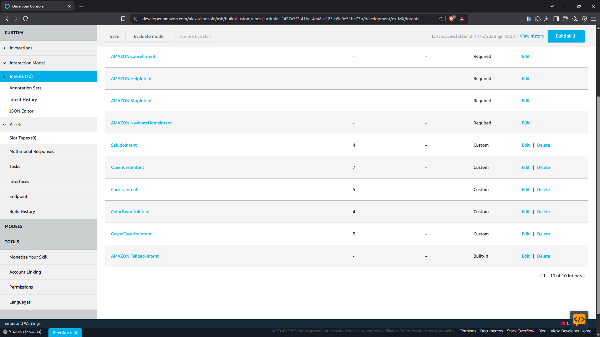
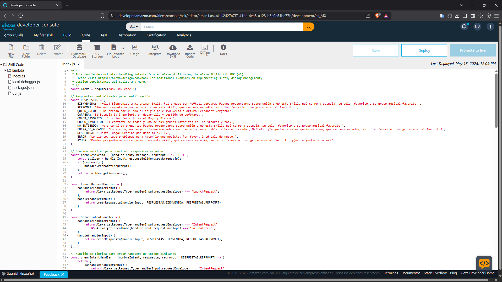
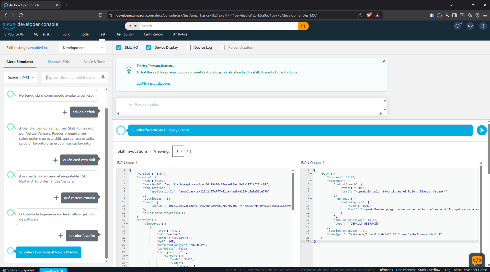

# PracticaAlexaSkills-220100

  
  

<h2>Universidad Tecnológica de Xicotepec de Juárez</h2>

**Materia:** Extracción de Conocimiento en Bases de Datos  
**Alumno:** Neftali Arturo Hernandez Vergara  
**Matrícula:** 220100  
**Práctica 03:** Funcionalidades por Comandos de Voz  

**Descripción:** Este proyecto implementa una skill personalizada para Alexa que permite interactuar mediante comandos de voz. Los usuarios pueden realizar consultas y ejecutar funcionalidades específicas relacionadas con la materia de Extracción de Conocimiento en Bases de Datos, facilitando el aprendizaje y la práctica de conceptos clave a través de la tecnología de asistentes virtuales.

**Fecha de Entrega:** 14 mayo 2025

---

# Capturas de Práctica

## Captura de Intents

## Captura de código

## Captura de test

